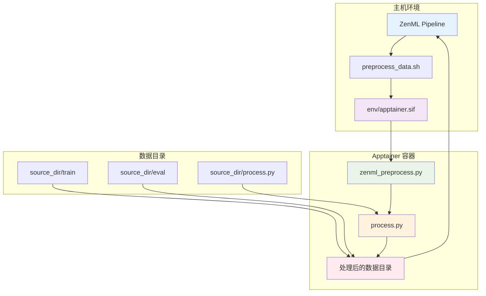
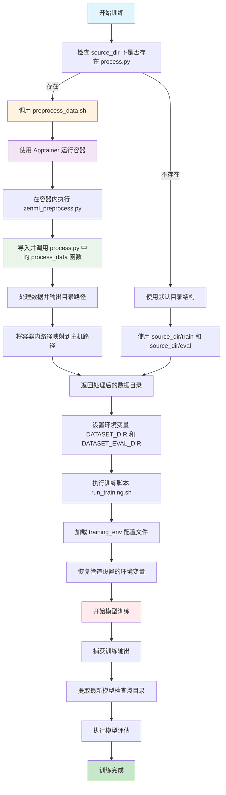
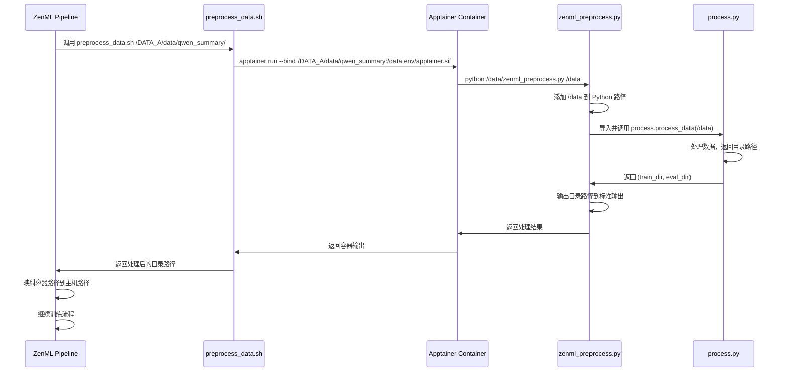

# ZenML 训练管道使用说明

## 📋 概述

这是一个基于 ZenML 的自动化训练管道，支持灵活的数据处理、模型训练和评估流程。管道能够自动处理数据输入、环境变量管理，并支持自定义数据处理逻辑。

## 🏗️ 系统架构

### 核心组件
- **`zenml_pipeline.py`**: ZenML 管道主文件，定义训练流程
- **`run_training.sh`**: 训练执行脚本，支持环境变量管理
- **`training_env`**: 环境配置文件，包含训练参数
- **`src/train.py`**: 实际训练逻辑
- **`default_config.yaml`**: Accelerate 配置文件

### 容器化数据处理架构



### 文件映射关系

| 主机路径 | 容器内路径 | 说明 |
|---------|-----------|------|
| `source_dir/` | `/data/` | 数据源目录挂载点 |
| `source_dir/process.py` | `/data/process.py` | 自定义处理脚本 |
| `source_dir/train/` | `/data/train/` | 训练数据目录 |
| `source_dir/eval/` | `/data/eval/` | 评估数据目录 |
| `source_dir/processed_*/` | `/data/processed_*/` | 处理后的数据目录 |

## 🚀 快速开始

### 完整训练流程

#### 1. 启动 ZenML 服务
```bash
# 在服务器上启动 ZenML 本地服务
zenml login --local
```

#### 2. 配置端口转发（可选）
```bash
# 在本地机器上执行，用于远程访问 ZenML 界面
ssh -L 8237:localhost:8237 gpuserver@服务器IP
```

#### 3. 执行训练
```bash
# 使用默认配置
python zenml_pipeline.py --source_dir /path/to/data

# 指定训练脚本和环境
python zenml_pipeline.py \
  --source_dir /path/to/data \
  --training_script run_training.sh \
  --training_env training_env
```

#### 4. 监控训练进度
- 通过 ZenML 界面监控：`http://localhost:8237` 或 `http://服务器IP:8237`
- 查看训练日志和指标
- 监控模型性能

### 命令行参数

| 参数 | 必需 | 默认值 | 说明 |
|------|------|--------|------|
| `--source_dir` | ✅ | - | 数据源目录路径 |
| `--training_script` | ❌ | `run_training.sh` | 训练脚本路径 |
| `--training_env` | ❌ | `None` | 训练环境配置文件路径 |

## 📁 数据目录结构

### 默认结构
```
source_dir/
├── train/          # 训练数据目录
├── eval/           # 评估数据目录
└── process.py      # 可选：自定义数据处理脚本
```

### 自定义数据处理
如果 `source_dir` 下存在 `process.py`，管道会调用其中的 `process_data(source_dir)` 函数：

```python
def process_data(source_dir: str) -> tuple:
    """
    自定义数据处理函数
    
    Args:
        source_dir: 数据源目录路径
        
    Returns:
        tuple: (训练数据目录, 评估数据目录)
    """
    # 自定义数据处理逻辑
    train_dir = os.path.join(source_dir, "processed_train")
    eval_dir = os.path.join(source_dir, "processed_eval")
    return train_dir, eval_dir
```

## 🔧 环境配置

### training_env 文件格式
```bash
# 模型与数据配置
MODEL_NAME=/data/models/Qwen3-1.7B/
DATASET_DIR=/data/data/qwen_summary/train/
DATASET_EVAL_DIR=/data/data/qwen_summary/eval/
OUTPUT_DIR=/data/output/qwen_summary/lora_ft/

# 训练参数
EPOCHS=3
BATCH_SIZE=4
LEARNING_RATE=3e-4
LORA_RANK=32

# Weights & Biases 配置
WANDB_API_KEY=your_api_key
WANDB_PROJECT=ft0
WANDB_RUN_NAME=ft0-run-0
```

### 环境变量优先级
1. **ZenML 管道设置**: `DATASET_DIR` 和 `DATASET_EVAL_DIR` 由管道自动设置
2. **现有环境变量**: 如果已存在，不会被覆盖
3. **training_env 文件**: 其他配置参数从此文件加载

## 🔄 训练流程

### 处理流程图



### 详细流程说明

#### 1. 数据准备阶段 (`prepare_data`)
- 检查 `source_dir` 下是否存在 `process.py`
- 如果存在：调用 `preprocess_data.sh` → Apptainer 容器 → `zenml_preprocess.py` → `process_data()` 函数
- 如果不存在：使用默认的 `source_dir/train` 和 `source_dir/eval`
- 返回训练和评估数据目录的元组

#### 2. 模型训练阶段 (`train_model`)
- 设置 `DATASET_DIR` 和 `DATASET_EVAL_DIR` 环境变量
- 执行训练脚本，支持环境变量覆盖保护
- 捕获训练输出，提取最新的模型检查点目录
- 返回模型输出目录路径

#### 3. 模型评估阶段 (`evaluate_model`)
- 接收训练输出的模型目录
- 执行模型评估逻辑（待实现）
- 返回评估结果

### 容器化数据处理流程



## 🌐 ZenML 服务配置

### 启动 ZenML 本地服务
训练启动后，需要启动 ZenML 服务来管理训练流程：

```bash
# 启动 ZenML 本地服务
zenml login --local
```

### 端口转发配置
为了在本地访问服务器上的 ZenML 服务，需要设置端口转发：

```bash
# 在本地机器上执行端口转发
ssh -L 8237:localhost:8237 gpuserver@服务器IP
```

**说明**：
- `8237` 是 ZenML 的默认端口
- 将本地的 `8237` 端口流量转发到服务器的 `8237` 端口
- 允许本地访问服务器上的 ZenML 服务界面

### 访问 ZenML 界面
配置完成后，可以通过以下方式访问：
- **本地访问**: `http://localhost:8237`
- **服务器访问**: `http://服务器IP:8237`

### 服务管理
```bash
# 查看 ZenML 服务状态
zenml status

# 停止 ZenML 服务
zenml down

# 重启 ZenML 服务
zenml up
```

## 📊 输出目录管理

### 自动检查点检测
训练完成后，系统会自动：
1. 在 `OUTPUT_DIR` 中查找所有 `checkpoint-*` 目录
2. 按版本号排序，获取最新的检查点
3. 输出最新模型目录路径供评估使用

### 示例输出
```
/data/output/qwen_summary/lora_ft/checkpoint-1000
```

## 🛠️ 高级配置

### 自定义训练脚本
```bash
python zenml_pipeline.py \
  --source_dir /path/to/data \
  --training_script /path/to/custom_training.sh \
  --training_env /path/to/custom_env
```

### 环境变量保护机制
- 训练脚本会先检查并保存现有的 `DATASET_DIR` 和 `DATASET_EVAL_DIR`
- 加载 `training_env` 文件后，恢复保存的环境变量
- 确保管道设置的数据目录不被配置文件覆盖

## 🔍 故障排除

### 常见问题

1. **找不到 process.py**
   ```
   📂 未发现 process.py，使用默认目录结构
   ```
   - 正常情况，系统会使用默认的 `train/` 和 `eval/` 目录

2. **数据目录不存在**
   ```
   ⚠️ 警告: 训练数据目录不存在: /path/to/train
   ```
   - 检查数据目录路径是否正确
   - 确保数据已正确放置

3. **环境变量冲突**
   ```
   🔧 使用现有环境变量 DATASET_DIR: /existing/path
   ```
   - 系统会优先使用已存在的环境变量
   - 如需覆盖，请先取消设置环境变量

4. **ZenML 服务连接问题**
   ```
   ❌ 无法连接到 ZenML 服务
   ```
   - 确保 ZenML 服务已启动：`zenml login --local`
   - 检查端口转发配置：`ssh -L 8237:localhost:8237 gpuserver@服务器IP`
   - 验证服务状态：`zenml status`

5. **端口转发失败**
   ```
   ❌ 端口 8237 已被占用
   ```
   - 检查端口是否被占用：`netstat -tlnp | grep 8237`
   - 使用其他端口：`ssh -L 8238:localhost:8237 gpuserver@服务器IP`
   - 重启 SSH 连接

6. **Apptainer 容器问题**
   ```
   ❌ Apptainer 镜像不存在: env/apptainer.sif
   ```
   - 检查镜像文件是否存在：`ls -la env/apptainer.sif`
   - 确保镜像文件有执行权限
   - 验证 Apptainer 安装：`apptainer --version`

7. **容器内路径映射问题**
   ```
   ⚠️ 无法从输出中提取目录路径，使用默认路径
   ```
   - 检查 `zenml_preprocess.py` 是否正确输出目录路径
   - 验证容器内路径到主机路径的映射
   - 确保处理后的目录在主机上存在

8. **process.py 导入失败**
   ```
   ❌ 导入 process 模块失败
   ```
   - 检查 `source_dir/process.py` 是否存在
   - 验证 `process_data` 函数是否正确定义
   - 确保函数返回包含两个元素的元组

### 调试模式
```bash
# 查看详细的环境变量设置过程
export DEBUG=1
python zenml_pipeline.py --source_dir /path/to/data
```

## 📈 监控和日志

### 训练监控
- 支持 Weights & Biases 集成
- 自动记录训练指标和模型性能
- 实时监控训练进度

### 日志输出
- 详细的中文日志信息
- 环境变量设置和恢复过程
- 训练输出和错误信息

## 🔄 扩展功能

### 添加新的数据处理逻辑
1. 在 `source_dir` 下创建 `process.py`
2. 实现 `process_data()` 函数
3. 返回 `(训练目录, 评估目录)` 元组

### 自定义评估逻辑
修改 `evaluate_model` 函数，添加具体的评估实现：
```python
@step
def evaluate_model(output_dir: str):
    # 加载模型
    # 运行评估
    # 返回评估结果
```

## 📚 相关文件

### 核心文件
- `zenml_pipeline.py`: 主管道文件，定义训练流程
- `run_training.sh`: 训练执行脚本，支持环境变量管理
- `training_env`: 环境配置文件，包含训练参数
- `src/train.py`: 实际训练逻辑
- `default_config.yaml`: Accelerate 配置文件

### 容器化处理文件
- `preprocess_data.sh`: 数据预处理脚本，调用 Apptainer 容器
- `zenml_preprocess.py`: 容器内处理脚本，导入并执行 process.py
- `env/apptainer.sif`: Apptainer 容器镜像文件
- `env/apptainer.def`: Apptainer 镜像定义文件

### 文档文件
- `Training_Process.md`: 本文档，详细使用说明

---

